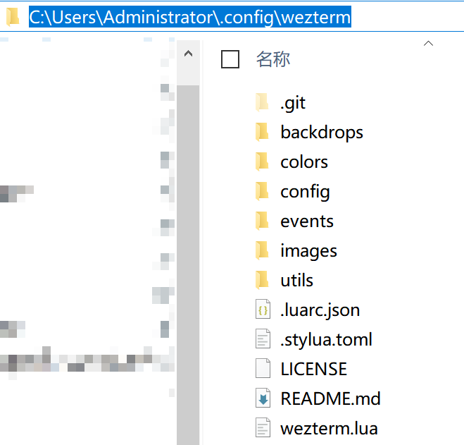

## My WezTerm configuration files

## Usage

Clone this repo to the folder `.config/` in the personal user directory.

On a Windows system, my account is `Administrator`, so the directory structure should look like this:

## Happy to you all the time.
